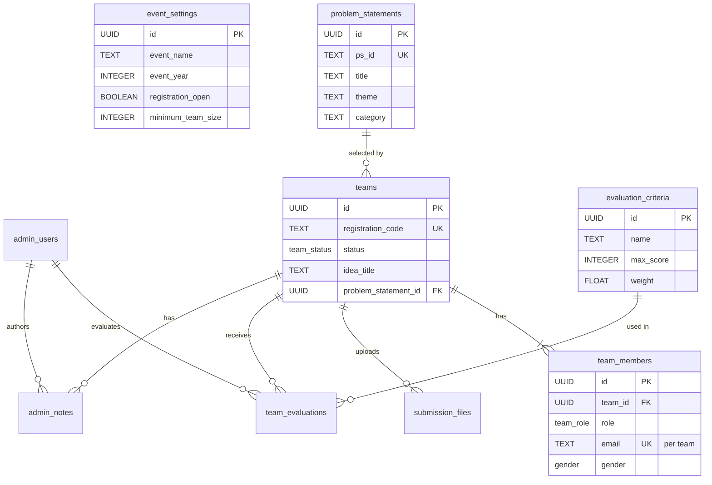

# Database Schema Architecture

The portal uses Supabase (PostgreSQL) with a highly relational schema and Row Level Security (RLS).

## ER Diagram

## Security & Access Control

All tables are protected by Row Level Security (RLS):
1. **Public/Anonymous Users**: Cannot write to any table. Can read active `problem_statements` and `evaluation_criteria`. Can read public `event-assets` storage bucket.
2. **Team Registration (Phase 2)**: Submissions are handled via server actions using the `SUPABASE_SERVICE_ROLE_KEY` to securely bypass RLS and insert data without exposing write permissions to the client.
3. **Super Admins**: Full read/write access to all tables via RLS.
4. **Evaluators (Phase 2)**: Can view teams, insert/update their *own* evaluations and notes.

## Audit Logging

An `audit_logs` table tracks critical events:
- Settings modifications
- PPT template uploads/replacements
- Evaluator scoring
- Admin status overrides

This provides accountability for all administrative actions.
